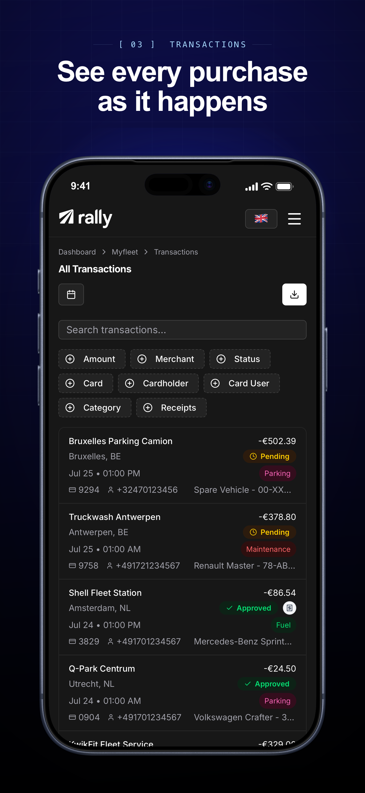
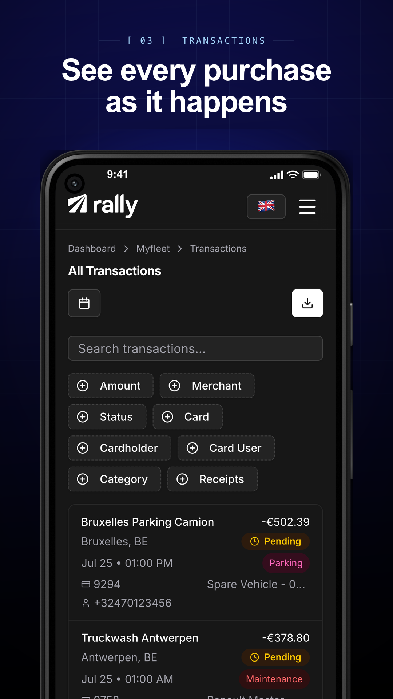

# storeshot

Apple and Google Play store screenshots, built by agents, for agents.

Both of these came out of the same config — one run, no design tool.

<table>
  <tr>
    <td width="50%">
      
    </td>
    <td width="50%">
      
    </td>
  </tr>
</table>

Describe the screens you want in a config file and get back store-ready assets:
real captures of your app, clipped into real device bezels, laid out under
marketing copy, at the exact pixel sizes Apple and Google accept, staged for
`fastlane deliver` and `supply`.

Works with native and web apps alike. Captures come from the iOS Simulator, an
Android emulator, a headless browser, or a directory of screenshots something
else produced — everything after that point is identical.

No design tool in the loop. The whole set is one command, so it can run in CI,
and an agent can change the copy or add a screen by editing one file.

## Why

The other ways of doing this all make you give something up:

| Tool                      | The catch                                                                                   |
| ------------------------- | ------------------------------------------------------------------------------------------- |
| 🐌 **fastlane** `frameit` | Fragile ImageMagick and JSON layout, device frames that trail Apple's hardware, native-only |
| 🖱️ **Mockup makers**      | Free, browser-based, one frame at a time by hand — nothing to run in CI                     |
| 🎨 **Design templates**   | Drift the moment the UI ships; every device and locale is re-exported by hand               |
| 💸 **Hosted generators**  | A subscription, an account, and your app's screens on someone else's servers                |

storeshot gives up none of them:

- ⚡ **One command** — `npx storeshot` captures, frames and stages a whole set, in CI or locally.
- 📱 **Native, web, or hybrid** — one pipeline for the iOS Simulator, an Android emulator, a headless browser, or PNGs something else produced. The rest of the field picks a side.
- 🌍 **Locales are JSON** — captions wrap and rebalance to fit; nothing overflows.
- 🎯 **Store rules, enforced** — exact sizes, no alpha, under 8 MB, Apple bezels whole, Android free to bleed. A bad asset fails the run, not the upload.
- 🤖 **Agent-first** — the whole job is one config file, so a coding agent can add a screen or rewrite the copy and the diff lands as images in a pull request.
- 🆓 **Open source, no account** — MIT, runs on your machine, frames cached locally.

## Install

```bash
npm install --save-dev github:thiagoperes/storeshot
```

Node 20 or newer. Nothing else, and no browser: the marketing canvas is composed
with [sharp](https://sharp.pixelplumbing.com), so a native app never downloads a
browser binary. Device bezels are fetched on first use and cached.

Capturing from a browser is the one thing that needs more. Playwright is an
optional peer dependency, so add it only for that:

```bash
npm install --save-dev playwright
npx playwright install webkit chromium
```

Composition shapes text with Pango, so at least one font has to be installed. A
desktop or a normal CI runner already has plenty; a slim Linux image may need a
package such as `fonts-dejavu-core`. Name real families in your theme —
`-apple-system` and other CSS keywords mean nothing outside a browser and are
skipped over in the stack.

## Quick start

The examples below build the real App Store and Play sets for
[Rally](https://getrally.com), a fleet expense platform that ships on both
stores.

### iOS

`storeshot.ios.config.ts` — the App Store set, captured from the real build in
the Simulator. Requires macOS with Xcode.

```ts
import { defineConfig, findTarget } from 'storeshot';

export default defineConfig({
  // Rally's iOS app is iPhone-only, so the iPad target comes off. Apple scales
  // the 6.9" set down for every smaller iPhone, so one target covers them all.
  targets: [findTarget('ios-iphone-6.9')],

  capture: {
    kind: 'ios-simulator',
    // First name that exists wins, and an already-booted device is preferred.
    device: ['iPhone 17 Pro Max', 'iPhone 16 Pro Max'],
    bundleId: 'com.getrally',
    appPath: 'ios/App/build/Debug-iphonesimulator/App.app',
  },

  // A launch and a route change need longer to settle than a browser does.
  settleDelay: 2500,

  screens: [
    { id: 'platform', theme: 'dark' },
    { id: 'transactions', theme: 'dark' },
    { id: 'cards', theme: 'dark' },
  ],

  captions: {
    en: {
      platform: { kicker: 'Payments', title: 'Every fleet expense, one app' },
      transactions: {
        kicker: 'Transactions',
        title: 'See every purchase as it happens',
      },
      cards: { kicker: 'Cards', title: 'Issue cards in seconds, not days' },
    },
  },
});
```

```bash
npx storeshot --config storeshot.ios.config.ts
```

Captures come out full-screen, with the device's own status bar, pinned to 9:41
on a full battery. Rally's screens are ordinary in-app routes with no URL scheme
behind them, so this run stops and asks you to navigate before each capture. Give
a screen a `deepLink`, or the config a `navigate` hook, to make it unattended —
see [Navigating a native app](#navigating-a-native-app).

### Android

`storeshot.android.config.ts` — the Play set, from the release APK on an
emulator. Requires the Android SDK platform tools on your `PATH`.

```ts
import { defineConfig, findTarget } from 'storeshot';

export default defineConfig({
  // Play asks for a phone and a tablet asset separately.
  targets: [findTarget('android-phone'), findTarget('android-tablet')],

  capture: {
    kind: 'android-emulator',
    appId: 'com.getrally.app',
    apkPath: 'android/app/build/outputs/apk/release/app-release.apk',
    // Booted when nothing is already attached. Omit to use `adb`'s only device.
    avd: 'Pixel_5_API_35',
  },

  screens: [
    {
      id: 'platform',
      deepLink: 'https://app.getrally.com/home',
      theme: 'dark',
    },
    {
      id: 'cards',
      deepLink: 'https://app.getrally.com/home/cards',
      theme: 'dark',
    },
  ],

  captions: {
    en: {
      platform: { kicker: 'Payments', title: 'Every fleet expense, one app' },
      cards: { kicker: 'Cards', title: 'Issue cards in seconds, not days' },
    },
  },
});
```

```bash
npx storeshot --config storeshot.android.config.ts
```

A `deepLink` here is anything `adb shell am start` can open, so an app link like
the one above works without registering a custom scheme, as long as the app
declares the intent filter. Play allows the device to bleed off the bottom edge,
and these targets do, where the App Store ones above keep the bezel whole.

### A web or hybrid app

Rally is a Capacitor app, so the same screens can be captured headless in
seconds without building either binary — WebKit for iOS targets, Chromium for
Android ones, matching the web view each platform actually runs. This is Rally's
default config, with the two native ones above kept for checking the native shell
before a listing refresh.

```ts
import { defineConfig } from 'storeshot';

export default defineConfig({
  baseUrl: process.env.SCREENSHOT_BASE_URL ?? 'http://localhost:3000',
  screens: [
    {
      id: 'platform',
      path: '/home/acme',
      theme: 'dark',
      // Nothing is captured until these are on screen, so no skeletons.
      waitFor: ['[data-slot="card"]'],
    },
  ],
  captions: {
    // as above
  },
  // Signs in once; the session is reused across targets.
  auth: ({ page }) => signIn(page),
});
```

```bash
npx storeshot
```

Whichever route you take, assets land in
`screenshots/framed/<locale>/<target>/` and are copied into `fastlane/` in the
layout `deliver` and `supply` expect.

Captions wrap to fit and, at two lines, rebalance so the lines come out close to
equal instead of leaving a stub on the second. Put a `\n` in a title to break it
somewhere specific and that is used verbatim.

## What comes out

Four targets are built in, chosen to satisfy both stores with the smallest
possible set. Apple scales the 6.9" iPhone and 13" iPad sets down for every
smaller device, so those two cover the App Store.

| Target           | Store  | Screen      | Output      | Frame             |
| ---------------- | ------ | ----------- | ----------- | ----------------- |
| `ios-iphone-6.9` | Apple  | 1320 × 2868 | 1320 × 2868 | iPhone 17 Pro Max |
| `ios-ipad-13`    | Apple  | 2048 × 2732 | 2064 × 2752 | iPad Pro 12.9"    |
| `android-phone`  | Google | 1080 × 2340 | 1080 × 1920 | Pixel 5           |
| `android-tablet` | Google | 1680 × 2440 | 1440 × 2560 | Neutral CSS bezel |

A target describes its screen in points and a scale factor, which is the same
arithmetic for both worlds: an iPhone 17 Pro Max is 440 × 956pt at 3x, or
1320 × 2868px, whether that comes from a simulator or a browser viewport. If your
device's screenshot is a slightly different size but the same shape — the frame
set's 12.9" iPad cutout is 2048 × 2732 while the simulator shoots 2064 × 2752 — it
is resampled. A genuinely different aspect ratio is refused rather than squashed.

Every asset is flattened to 24-bit PNG and checked before it is written: wrong
dimensions, a leftover alpha channel, or a file over Google's 8 MB cap fails the
run rather than the upload.

Store rules are encoded, not left to the author. Apple requires product bezels
to be shown uncropped with copy beside the device rather than on it, so App
Store targets keep the device whole and use a background bloom instead of a drop
shadow. Play has no such rule, so those targets may bleed the device off the
bottom edge.

## Capture sources

Capture is a driver behind one interface, so where the pixels come from is a
config choice and nothing downstream changes. Set `capture` once for everything,
or per platform when a native iOS build and a native Android build need different
tooling. Individual targets can override it.

### `ios-simulator`

Drives a real build in the Simulator through `xcrun simctl`. Requires macOS with
Xcode.

```ts
capture: {
  kind: 'ios-simulator',
  device: ['iPhone 17 Pro Max', 'iPhone 16 Pro Max'],
  bundleId: 'com.acme.App',
  appPath: 'build/Debug-iphonesimulator/App.app',
}
```

It prefers a device that is already booted, boots one if not, and creates the
simulator outright when no instance matches — which is the normal state of a
fresh machine or CI runner. Before capturing it pins the status bar to Apple's
canonical marketing state: 9:41, full battery, full signal. Screenshots are the
whole screen, real status bar included.

### `android-emulator`

The same idea over `adb`, against an emulator or an attached device.

```ts
capture: {
  kind: 'android-emulator',
  appId: 'com.acme.app',
  apkPath: 'build/outputs/apk/release/app-release.apk',
  avd: 'Pixel_5_API_34', // booted only if nothing is attached
}
```

SystemUI demo mode stands in for the iOS status bar override, giving a fixed
clock, a full battery and no notification icons.

### `import`

Frames screenshots something else produced — XCUITest, `fastlane snapshot`,
Espresso, or a designer's export.

```ts
capture: {
  kind: 'import',
  dir: 'fastlane/screenshots',
  // Defaults to `<target>/<screen>.png`.
  file: ({ locale, screen }) => `${locale}/iPhone 17 Pro Max-${screen.id}.png`,
}
```

This is the shortest path if you already have UI tests that take screenshots:
keep taking them however you like and adopt only the framing and delivery half of
the pipeline.

### `web`

The default. Playwright loads each screen at the device's exact viewport, using
WebKit for iOS targets and Chromium for Android ones, so the render engine
matches the web view the app will ship in. Suits anything served over HTTP,
including Capacitor, Cordova and Electron wrappers.

### `custom`

Anything else — a device farm, `idb`, an Appium session.

```ts
capture: {
  kind: 'custom',
  includesStatusBar: true,
  open: async ({ target, config }) => ({
    capture: async (screen, locale) => myDeviceFarm.shoot(target.id, screen.id),
    close: async () => myDeviceFarm.release(),
  }),
}
```

## Navigating a native app

A native driver gets your app to each screen in one of three ways, in order of
preference:

1. **A deep link** on the screen — `deepLink: 'acme://cards'` — opened with
   `simctl openurl` or an `android.intent.action.VIEW` intent. Best option: fully
   unattended, and most apps that support universal links already have this.
2. **A `navigate` hook** in the config, which receives the screen and the device
   handle so it can shell out to `idb`, `adb shell input`, or your own UI
   automation.
3. **Nothing**, in which case it prompts you to drive the app by hand and press
   Enter before each capture. Slow, but it gets a listing shipped today and the
   captures are reusable — `--skip-capture` reframes them as often as you like.

Native apps often need longer than the 900 ms default to settle after a launch or
a deep link. Raise `settleDelay` if a capture lands mid-transition.

## How it works

1. **Capture.** One of the sources above produces a PNG per screen.
2. **Status bar.** Native captures already have a real one. A browser capture has
   none, so the page is captured shorter by exactly the status bar's height and a
   synthetic strip is stacked on top. The strip samples the colour of your app's
   top row so it disappears into the design, and no app content ends up hidden
   behind it.
3. **Frame.** The capture is composited into a device bezel from
   [`fastlane/frameit-frames`](https://github.com/fastlane/frameit-frames),
   clipped through a mask traced from the frame's own alpha channel so the
   rounded corners and the Dynamic Island cut the screenshot exactly the way the
   hardware does.
4. **Compose.** The framed device and its caption are laid out at the store's
   output size. The backdrop is an SVG rasterised by librsvg, the type is shaped
   by Pango and measured before it is placed, and the device is resampled by
   sharp. Captions reflow and rebalance per locale rather than being baked into a
   fixed-width bitmap, and none of it needs a browser.
5. **Deliver.** Assets are flattened, validated, and staged under `fastlane/`.

## Configuration

Everything below `screens` and `captions` is optional.

```ts
import { defineConfig } from 'storeshot';

import en from './captions/en.json' with { type: 'json' };

export default defineConfig({
  // Browser captures only.
  baseUrl: process.env.APP_URL ?? 'http://localhost:3000',

  // Where output and caches go. Relative to the config file.
  outDir: 'screenshots',
  fastlaneDir: 'fastlane',

  screens: [
    {
      id: 'dashboard',
      // A path for browser captures, a deepLink for native ones.
      path: '/app/dashboard',
      theme: 'dark',
      // Nothing is captured until these are visible, so no skeletons.
      waitFor: ['[data-slot="card"]'],
      // Hidden before the shot, on top of the global `hide` list.
      hide: ['.cookie-banner'],
      // Skip a form factor the screen makes no sense on.
      excludeTargets: ['ios-ipad-13'],
    },
  ],

  captions: { en },

  // Any subset. The rest falls back to a neutral built-in theme.
  theme: {
    dark: {
      base: '#000000',
      sweep: 'linear-gradient(176deg, #0F1053 0%, #070826 44%, #000000 100%)',
      halo: '#1A2BC3',
      title: '#FFFFFF',
      kicker: '#A6D8FD',
    },
    // Real installed families. A `linear-gradient` above takes an angle or a
    // `to <side>`, with hex, rgb() or rgba() stops.
    sansFont: '"Inter", "Helvetica Neue", sans-serif',
    showIndex: true,
  },

  // Browser captures: signs in once, and the session is reused per target.
  async auth({ page }) {
    await page.goto('/login');
    await page.getByLabel('Email').fill(process.env.DEMO_EMAIL!);
    await page.getByLabel('Password').fill(process.env.DEMO_PASSWORD!);
    await page.getByRole('button', { name: 'Sign in' }).click();
    await page.waitForURL((url) => !url.pathname.startsWith('/login'));
  },

  // Browser captures: runs before each screen navigates.
  async prepare({ context, page, screen }) {
    await context.addCookies([
      { name: 'theme', value: screen.theme, domain: 'localhost', path: '/' },
    ]);
    await page.route('**/api/telemetry', (route) => route.abort());
  },

  // Native captures: drives the app when a screen has no deepLink.
  async navigate({ screen, device, platform }) {
    if (platform === 'ios') {
      await myUiAutomation.tapTab(device, screen.id);
    }
  },
});
```

`targets` can be overridden too, if you need a device the defaults do not cover.
Import `DEFAULT_TARGETS` and spread it, or write your own `TargetSpec[]`.

## CLI

```
storeshot [options]

  --config <path>    Config file. Default: nearest storeshot.config.ts.
  --base-url <url>   Override the app URL from the config.
  --target <id>      Only this target (repeatable). Default: all.
  --screen <id>      Only this screen (repeatable). Default: all.
  --locale <code>    Caption locale (repeatable). Default: all configured.
  --skip-capture     Recompose from the existing raw captures.
  --skip-compose     Capture only.
  --fresh-auth       Ignore the cached session and sign in again.
```

`--skip-capture` is the one to know: iterating on copy or colours reuses the
captures already on disk, so the loop is seconds rather than minutes. That matters
more for native, where a capture pass means booting a simulator.

To capture the same app two ways — headless for speed, a real simulator to check
fidelity before a listing refresh — keep a second config that overrides only
`capture` and select it with `--config`.

## Working with an agent

The config is the whole interface, which makes this a good tool to hand to a
coding agent. Useful things to ask for:

- "Add a screen for the billing page and write a caption for it."
- "Rewrite the captions to lead with the benefit, keep them under six words."
- "Try the halo in our accent colour and show me the iPhone set."

Each is a small edit to one file followed by `storeshot --skip-capture`, and the
diff is reviewable as images in a pull request. The library API is exported too,
if you would rather script the pipeline than shell out:

```ts
import { loadConfig, parseOptions, run } from 'storeshot';
```

Note that the package ships TypeScript source and is loaded through
[jiti](https://github.com/unjs/jiti), so importing it from plain Node without a
TypeScript loader will not work. The CLI handles this for you.

## Prior art

[fastlane](https://fastlane.tools) `snapshot` and `frameit` cover the same ground
for native apps, and if you already run them happily there is little reason to
switch. The differences that motivated this: capture is a driver rather than a
requirement, so native, web and pre-made screenshots go through one pipeline;
composition is SVG and Pango through sharp instead of ImageMagick, so captions
reflow and the layout uses your own design tokens; and it needs no UI-test suite
to get started. Deliberately
not reimplemented is running your tests — `xcodebuild test` is fastlane's job, and
the `import` driver consumes whatever it produces. The device bezels come from
fastlane's own frame set.

## License

MIT
